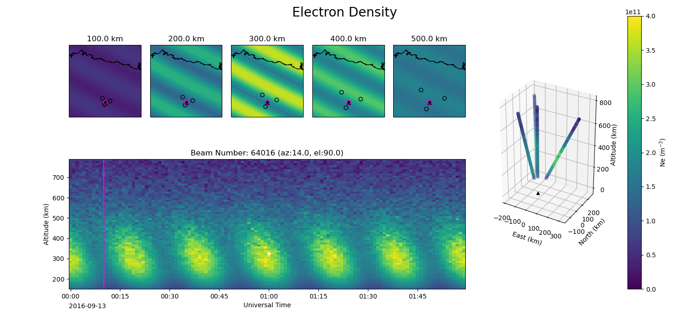

amisrsynthdata
==============

This module provides tools to create synthetic data files for the AMISR (Advanced Module Incoherent Scatter Radar) systems.  The files are based on both a specified ionospheric state and a radar configuration.  This can be used to generate synthetic data in the "SRI data format" both for the three existing AMISRs and for hypothetical future "AMISR-like" systems.  Primarily, it was designed to help test the functionality of various inversion algorithms that attempt to create a complete picture of ionospheric state parameters from discrete measurements by creating a way to check the output of these algorithms against known "truth" data.  Please note that this module does NOT attempt to simulate any aspect of fundamental ISR theory.

Quick Start
-----------

Installation
************

The amisrsynthdata package is pure python and can be installed easily with pip:

.. code-block::

  $ pip install amisrsynthdata

Additional `installation instructions <https://amisrsynthdata.readthedocs.io/en/latest/installation.html#>`_
are also available.

Basic Usage
***********

This package installs the command line tool `amisrsynthdata`, which is used along with a YAML configuration file to generate an output hdf5 AMISR data file.  The configuration file specifies the ionosphere state and radar configuration that should be used:

.. code-block::

  $ amisrsynthdata config.yaml

Refer to the `configuration file docs <https://amisrsynthdata.readthedocs.io/en/latest/configfile.html#>`_ for information about the contents of these configuration files and how to construct one.

Limitations
-----------

The following are NOT currently included in the amisrsynthdata module:

1. Any kind of proper treatment or simulation of ISR theory - The module effectively assumes the radar measures plasma parameters perfectly at a particular location, although empirical errors can be added.
2. Integration over a time period or smearing along the length of pulses, as well as pulse coding.
3. Madrigal data format - Currently files are only generated in the SRI data format.

Documentation
-------------

Full documentation for amisrsynthdata is available on `ReadTheDocs <https://amisrsynthdata.readthedocs.io/en/latest/index.html>`_.

Contributing
------------

Contributions to this package are welcome and encouraged, particularly to expand the currently set of specified ionospheres.  Contributions can take the form of `issues <https://github.com/amisr/amisrsynthdata/issues>`_ to report bugs and request new features and `pull requests <https://github.com/amisr/amisrsynthdata/pulls>`_ to submit new code.  Please refer to the `contributing guidelines <https://amisrsynthdata.readthedocs.io/en/latest/contributing.html#>`_ for more details.  Specific instructions on how to add a new state function to describe the ionosphere are available in `New State Functions <https://amisrsynthdata.readthedocs.io/en/latest/ionostate.html#>`_.

