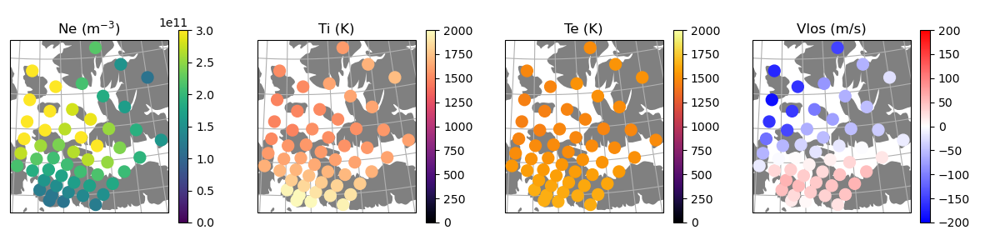

amisrsynthdata
==============

This module provides tools to create synthetic data files for the AMISR (Advanced Module Incoherent Scatter Radar) systems.  The files are based on both a specified ionospheric state and a radar configuration.  This can be used to generate synthetic data in the "SRI data format" both for the three existing AMISRs and for hypothetical future "AMISR-like" systems.  Primarily, it was designed to help test the functionality of various inversion algorithms that attempt to create a complete picture of ionospheric state parameters from discrete measurements by creating a way to check the output of these algorithms against known "truth" data.  Please note that this module does NOT attempt to simulate any aspect of fundamental ISR theory.

.. image:: docs/synthdata_summary_ne.png

Quick Start
-----------

Installation
************

The amisrsynthdata package is pure python and can be installed with pip:

.. code-block::

  pip install amisrsynthdata

Additional `installation instructions <https://amisrsynthdata.readthedocs.io/en/stable/installation.html#>`_
are also available.

Example Usage
*************

This package installs the command line tool `amisrsynthdata`, which is used along with a YAML configuration file to generate an output hdf5 AMISR data file.  The configuration file specifies the ionosphere state and radar configuration that should be used.  The following steps show how to use a provided example configuration file to run amisrsythdata.

1. Install amisrsynthdata with the plots option.

.. code-block::

   pip install amisrsynthdata[plots]

2. Download the `example configuration file <https://github.com/amisr/amisrsynthdata/blob/main/example_synth_config.yaml>`_.

.. code-block::

   wget https://raw.githubusercontent.com/amisr/amisrsynthdata/refs/heads/main/example_synth_config.yaml

3. Run amisrsynthdata with the verbose option.

.. code-block::

  amisrsynthdata example_synth_config.yaml -v

This should product the output synthetic data file ``synthetic_data.h5`` and four summary plot files in your working directory.  By editing the options in the configuration file, you can specify the radar mode and ionosphere that are used to create the synthetic data.  Refer to the `configuration file documentation <https://amisrsynthdata.readthedocs.io/en/stable/configfile.html>`_ for information about the contents of the configuration file.

Additional information about using this pacakge is available in the `usage documentation <https://amisrsynthdata.readthedocs.io/en/stable/usage.html>`_.

Limitations
-----------

The following are NOT currently included in the amisrsynthdata module:

1. Any kind of proper treatment or simulation of ISR theory - The module effectively assumes the radar measures plasma parameters perfectly at a particular location, although empirical errors can be added.
2. Integration over a time period or smearing along the length of pulses, as well as pulse coding.
3. Madrigal data format - Currently files are only generated in the SRI data format.

Documentation
-------------

Full documentation for amisrsynthdata is available on `ReadTheDocs <https://amisrsynthdata.readthedocs.io>`_.

Contributing
------------

Contributions to this package are welcome and encouraged, particularly to expand the currently set of specified ionospheres.  Contributions can take the form of `issues <https://github.com/amisr/amisrsynthdata/issues>`_ to report bugs and request new features and `pull requests <https://github.com/amisr/amisrsynthdata/pulls>`_ to submit new code.  Please refer to the `contributing guidelines <https://amisrsynthdata.readthedocs.io/en/stable/contributing.html>`_ for more details.  Specific instructions on how to add a new state function to describe the ionosphere are available in `Create New State Functions <https://amisrsynthdata.readthedocs.io/en/stable/ionostate.html#create-new-state-functions>`_.

